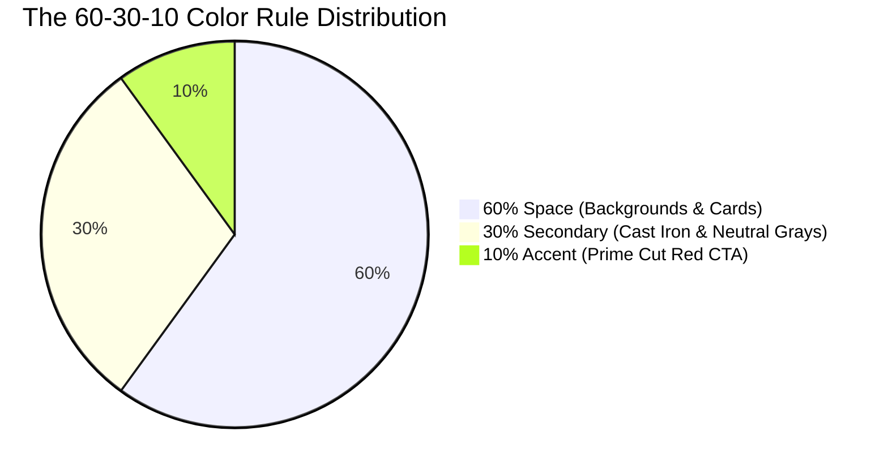

# Cebu Central Meatshop — Design System & UI Components

This document outlines the **design system, color tokens, typography rules, interactive behaviors, and reusable UI primitives** used to build the Cebu Central Meatshop frontend application. It serves as the single source of truth for maintainers and designers to ensure a consistent, responsive, and cohesive user experience across all devices.

---

## 1. Design Philosophy

The Cebu Central Meatshop design system is engineered around **visual premiumness, readability, and clean layout structures**. It utilizes a **60-30-10 layout proportion rule** to guide users' eyes to key call-to-actions (CTAs) while maintaining a balanced, high-contrast digital presentation.



- **60% Primary Surface (Gallery White)**: High-exposure, clean light backgrounds that make product imagery stand out.
- **30% Secondary/Neutral (Cast Iron)**: Rich, deep slate and charcoal tones used for header shells, cards, text hierarchy, and containers.
- **10% Call to Action (Prime Cut Red)**: A vibrant, high-contrast red reserved strictly for buttons, active states, price points, and focal highlights.

---

## 2. Color System & Design Tokens

Theme tokens are declared as HSL variables in [globals.css](file:///c:/Users/User/Desktop/webdev/Cebu_Central_Meatshop/frontend/src/styles/globals.css) and exposed in [tailwind.config.js](file:///c:/Users/User/Desktop/webdev/Cebu_Central_Meatshop/frontend/tailwind.config.js).

### 2.1 CSS Variables (HSL Format)

| CSS Variable | Light Theme HSL | Hex Equivalent | Core Application |
| :--- | :--- | :--- | :--- |
| `--background` | `0 0% 98.4%` | `#FBFBFB` | Main page background (60%) |
| `--foreground` | `210 7.1% 11%` | `#1A1C1E` | Primary body text and headers |
| `--card` | `0 0% 100%` | `#FFFFFF` | Item cards, modal panels |
| `--secondary` | `210 7.1% 11%` | `#1A1C1E` | Muted backgrounds, dark elements (30%) |
| `--secondary-foreground` | `0 0% 98.4%` | `#FBFBFB` | Text resting on secondary background |
| `--primary` | `350 85.2% 42.4%` | `#C8102E` | Prime Cut Red CTAs, highlighting (10%) |
| `--primary-foreground` | `0 0% 98.4%` | `#FBFBFB` | Text resting on primary red components |
| `--muted` | `210 7.1% 94%` | `#EEF0F2` | Subtle borders, light grey backgrounds |
| `--muted-foreground` | `210 7.1% 45%` | `#6C757D` | Secondary body copy, subtitle notes |
| `--border` / `--input` | `210 7.1% 85%` | `#D9DFE3` | Dividers, text field borders |
| `--ring` | `350 85.2% 42.4%` | `#C8102E` | Focus outlines & interactive ring glows |
| `--radius` | `0.5rem` | — | Border radius base variable |

### 2.2 Dark Mode Support
Dark mode classes are defined under `.dark` block inside [globals.css](file:///c:/Users/User/Desktop/webdev/Cebu_Central_Meatshop/frontend/src/styles/globals.css). The primary red accent remains constant (`350 85.2% 42.4%`) to preserve brand identity across themes, while neutral scales invert dynamically:

```css
.dark {
  --background: 210 7.1% 11%;      /* Deep Cast Iron Background */
  --foreground: 0 0% 98.4%;        /* Off-white text */
  --card: 210 7.1% 11%;
  --muted: 210 3.7% 15.9%;
  --border: 210 3.7% 15.9%;
}
```

---

## 3. Typography System

The application utilizes two distinct Google Font families loaded in [index.html](file:///c:/Users/User/Desktop/webdev/Cebu_Central_Meatshop/frontend/index.html).

### 3.1 Font Families

| Font Role | Font Name | Applied Tailwind Class | Usage Scope |
| :--- | :--- | :--- | :--- |
| **Display/Headings** | Plus Jakarta Sans | `font-display` | Page Titles, h1, h2, h3, card headers, promos |
| **Body/Interface** | Inter | `font-sans` | Body copy, forms, inputs, table contents, buttons |

### 3.2 Heading Styles & Weights
Headings are configured globally to default to `font-display` with tight tracking:

```css
h1, h2, h3, h4, h5, h6 {
  @apply font-display tracking-tight text-foreground font-semibold;
}
```

---

## 4. Reusable UI Components (Primitive Catalog)

The project includes **16 custom UI primitives** located in [components/ui](file:///c:/Users/User/Desktop/webdev/Cebu_Central_Meatshop/frontend/src/components/ui). Each is designed to be atomic, accessible, and style-controlled via `class-variance-authority` (CVA).

```
frontend/src/components/ui/
├── Button.tsx        # CTA and links with scaling hover/spinner
├── Badge.tsx         # Labels (default, success, destructive)
├── Card.tsx          # Card shell, Header, Content, Footer slots
├── Dialog.tsx        # Modal layers using Radix UI
├── Sheet.tsx         # Slide-out drawers (e.g., Mobile Navigation)
├── DropdownMenu.tsx  # Dynamic context menus using Radix UI
├── Input.tsx         # Controlled inputs with error state support
├── Label.tsx         # Semantic form labels
├── Checkbox.tsx      # Accessible checklist items
├── Textarea.tsx      # Multiline text entries
├── Alert.tsx         # System messages (info, success, warning)
├── Toaster.tsx       # Alert toast emitter (Sonner)
├── EmptyState.tsx    # Fallback view for empty lists
├── FadeIn.tsx        # Motion wrapper using Framer Motion
├── Skeleton.tsx      # Content placeholders for lazy loading
└── Spinner.tsx       # Loading animation helper
```

### 4.1 Button (`Button.tsx`)
A flexible primitive that acts either as a regular `<button>` or a React Router `<Link>` / standard anchor `<a>` depending on whether an `href` prop is supplied. Includes micro-interaction scales (`hover:scale-[1.02] active:scale-95`).

#### Variants & Sizes
- **Default**: Red background, white text.
- **Secondary**: Dark background, white text.
- **Outline**: Transparent background, border.
- **Ghost**: Hover secondary overlay.
- **Sizes**: `sm` (h-9), `default` (h-10), `lg` (px-8 py-3.5).

```tsx
import { Button } from "@/components/ui/Button";

// CTA Link Component
<Button href="/shop/beef" size="lg" variant="default">
  Shop Beef
</Button>

// Loading Button Trigger
<Button isLoading disabled>
  Processing Order
</Button>
```

### 4.2 Badge (`Badge.tsx`)
Small pills used for status representation, stock counts, or category labels.

#### Variants
- `default` (Red brand pill)
- `secondary` (Cast Iron neutral)
- `success` (Light green transparent background + dark green text)
- `destructive` (High-contrast warning red)
- `outline` (Text color with matching border)

```tsx
import { Badge } from "@/components/ui/Badge";

<Badge variant="success">In Stock</Badge>
<Badge variant="destructive">Sold Out</Badge>
```

### 4.3 Card (`Card.tsx`)
Highly modular wrapper cards used across grids (e.g. Featured Products). Consists of `<Card>`, `<CardHeader>`, `<CardTitle>`, `<CardDescription>`, `<CardContent>`, and `<CardFooter>`.

```tsx
import { Card, CardHeader, CardTitle, CardContent, CardFooter } from "@/components/ui/Card";

<Card className="hover:shadow-lg transition-all duration-300">
  <CardHeader>
    <CardTitle>Wagyu Ribeye Steak</CardTitle>
  </CardHeader>
  <CardContent>
    <p className="text-primary font-bold">₱2,450</p>
  </CardContent>
</Card>
```

### 4.4 Form Fields (`Input.tsx` & `Textarea.tsx`)
Standardized inputs that support labels, validation error alerts, and disabled states.

```tsx
import { Input } from "@/components/ui/Input";
import { Label } from "@/components/ui/Label";

<div>
  <Label htmlFor="email">Email Address</Label>
  <Input id="email" type="email" placeholder="you@example.com" error="Please enter a valid email." />
</div>
```

---

## 5. Responsive Layout Guidelines

To avoid inconsistencies (such as having layouts display correctly on desktop but shifting awkwardly on mobile), adhere to these layout patterns:

### 5.1 Single Source of Truth (SSOT) Alignment
Avoid using multiple viewport-specific wrappers or conditional screen splits for layout alignments unless absolutely necessary. Instead, write a layout configuration that scales cleanly across all breakpoints:

> [!TIP]
> Use Tailwind's auto-margins (`ml-auto`, `mr-auto`, `mx-auto`) combined with flexible flexbox/grid layout flows to position parent blocks, ensuring the text remains consistently aligned across both smaller and larger displays.

#### Right-Aligned Block Example (e.g., Hero Content)
Always keep text and CTA alignment in sync with the container block's position using standard block-level elements:

```tsx
{/* The content wrapper aligns text and children to the right on ALL screen sizes */}
<div className="max-w-2xl ml-auto text-right flex flex-col items-end">
  <h1 className="text-4xl md:text-6xl font-display font-extrabold text-white">
    Premium Grade Cuts
  </h1>
  <p className="text-lg md:text-2xl text-white/90 my-6 font-medium">
    Farm-to-table freshness, expertly butchered for your table.
  </p>
  <Button href="/shop/beef" size="lg">
    Shop Beef
  </Button>
</div>
```

### 5.2 Common Layout Breakpoints

| Breakpoint | Tailwind Prefix | Target Screen Size | Core Usage |
| :--- | :--- | :--- | :--- |
| **Default** | (none) | `< 768px` | Mobile layout (single-column, flex stacked) |
| **Medium** | `md:` | `≥ 768px` | Tablet & small laptops (multi-column grids, sidebar/sheets toggle) |
| **Large** | `lg:` | `≥ 1024px` | Desktop resolutions (full-width navigation links, 4-column product grids) |
| **Extra Large**| `2xl:` | `≥ 1400px` | Ultra-wide displays (centered container caps at max `1400px`) |

---

## 6. Micro-Animations & Transitions

We use `framer-motion` for complex transitions and standard CSS animations for micro-interactions:

- **Buttons**: `transition-all duration-200 hover:scale-[1.02] active:scale-95` — provides physical feedback on tap/click.
- **Grids & Cards**: `transition-transform duration-500 hover:scale-105` inside cards, or `group-hover:scale-110` for image zoom actions.
- **Entry Animations**: The `<FadeIn>` component wraps page stubs or cards, providing a smooth opacity slide-up when entering the viewport.

---

## 7. Adding New UI Components

If you need to introduce new primitives, follow the standard project patterns:
1. Initialize the component in [components/ui](file:///c:/Users/User/Desktop/webdev/Cebu_Central_Meatshop/frontend/src/components/ui).
2. Use **Radix UI** primitives for complex interactive components (e.g. Popovers, Tooltips, Tabs) to preserve accessibility features.
3. Write base styles using standard design tokens (like `border-border`, `bg-background`, `text-primary`). Do not introduce ad-hoc colors or inline styling properties that break dark mode compatibility.

---

## 8. Layout Consistency & Regression Prevention

To avoid layout regressions, design drift, or responsive layout inconsistencies in future UI edits, adhere to the following workflow principles:

### 8.1 Layout Abstraction Over Inline Classes
Avoid scattering direct, custom margin and alignment overrides across different page routes. If a specific alignment layout (e.g., right-aligned hero content) is reused, extract it into a layout component or helper class rather than re-declaring complex inline flex properties repeatedly.

### 8.2 Responsive Visual Regression Testing (VRT)
To verify style modifications do not break existing mobile or tablet layouts:
- Build snapshot tests using E2E engines (like **Playwright** or **Cypress**).
- Capture screenshots under `375px` (Mobile), `768px` (Tablet), and `1440px` (Desktop) viewport sizes during automated test runs.

### 8.3 Mobile-First CSS Alignment
When designing elements:
- Declare mobile-native styles first without media query overrides.
- Use responsive modifiers (`md:`, `lg:`) solely when larger viewport structures require distinct spacing or directional splits. If a UI section needs a unified layout behavior on all devices (e.g., matching text alignment), specify the base style globally.
